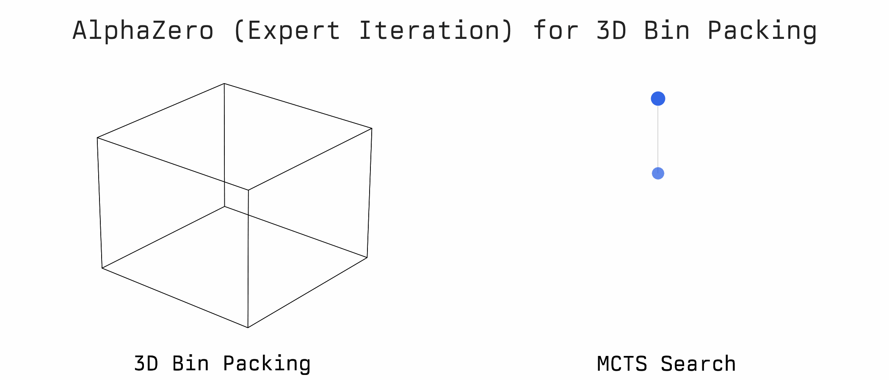
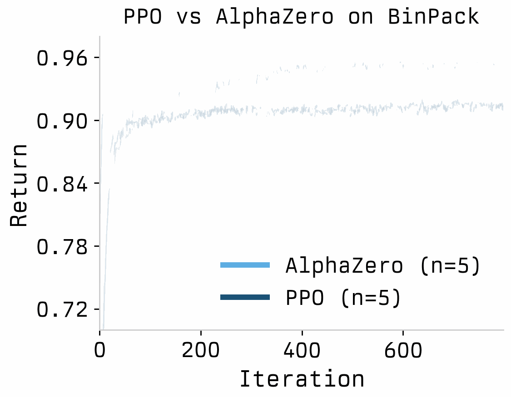

# Expert Iteration RL with Gumbel MuZero in JAX

**AlphaZero-style training for single-agent planning.** This repo combines [Expert Iteration](https://arxiv.org/abs/1705.08439) with [Gumbel MuZero](https://openreview.net/forum?id=bERaNdoegnO), using Gumbel MCTS as the "expert" that generates policy improvement targets, then distilling them into a fast neural policy—using JAX/XLA. Applied to Jumanji's 3D BinPack environment, we achieve **96% volume utilization** vs PPO's 90%.

**[Read the full blog post](https://aneeshers.github.io/mctx_knapsack/)** for a deeper dive into the theory and implementation details.



## Why Expert Iteration?

Traditional AlphaZero uses self-play because Go and Chess are two-player games. But 3D bin packing is a **single-agent planning task**—there's no opponent. So instead of self-play, we use MCTS to generate training targets directly:

> **Note:** This isn't vanilla Expert Iteration. We use **Gumbel MuZero** as the expert, which provides stronger policy improvement guarantees for large action spaces with limited simulation budgets. The `action_weights` from mctx aren't visit count proportions (like in the original EXIT paper); they're computed as `softmax(prior_logits + completed_Q)`, directly implementing the policy improvement operator from [Danihelka et al. (2022)](https://openreview.net/forum?id=bERaNdoegnO).

```
┌─────────────────────────────────────────────────────────────────────────────┐
│                                                                             │
│   ┌─────────┐      improved       ┌─────────┐      distill      ┌───────┐   │
│   │  MCTS   │ ───────────────────►│ Policy  │ ─────────────────►│  NN   │   │
│   │ Search  │      targets        │ Targets │      into         │Policy │   │
│   └─────────┘                     └─────────┘                   └───────┘   │
│        ▲                                                            │       │
│        │                          next iteration                    │       │
│        └────────────────────────────────────────────────────────────┘       │
│                                                                             │
│   The network improves → MCTS becomes stronger → better targets → ...       │
│                                                                             │
└─────────────────────────────────────────────────────────────────────────────┘
```

We actually have **perfect environment dynamics** for bin packing, so MCTS can simulate exact state transitions, and it can act as a strong "expert" that teaches the network. This is fundamentally different from model-based RL where you'd need to learn the dynamics.

## Results

Expert Iteration outperforms PPO on BinPack-v2:



| Method | Volume Utilization | Training Time |
|--------|-------------------|---------------|
| Expert Iteration (32 sims) | **96%** | ~4 hours |
| PPO | 90% | ~4 hours |

Despite running 32 MCTS simulations per decision, JAX parallelism keeps wall-clock time competitive with PPO.

## Installation

```bash
# Clone the repo
git clone https://github.com/Aneeshers/expert-iteration-rl.git
cd expert-iteration-rl

# Install dependencies
pip install jax jaxlib haiku optax mctx jumanji wandb omegaconf pydantic

# For GPU support (recommended)
pip install --upgrade "jax[cuda12_pip]" -f https://storage.googleapis.com/jax-releases/jax_cuda_releases.html
```

**Requirements:**
- Python 3.9+
- JAX 0.4+
- CUDA 11.8+ (for GPU training)

## Quick Start

### Train Expert Iteration

```bash
# Default settings (32 MCTS simulations, seed 0)
python train_expert_iteration_binpack.py

# Custom settings
python train_expert_iteration_binpack.py --num_simulations 64 --seed 42

# Override any config via CLI
python train_expert_iteration_binpack.py learning_rate=1e-4 rollout_batch_size=2048
```

### Train PPO Baseline

```bash
# Default settings
python train_ppo_binpack.py

# Custom seed
python train_ppo_binpack.py --seed 42
```

### Monitor Training

Both scripts log to [Weights & Biases](https://wandb.ai). Key metrics:
- `rollout/avg_return`: Volume utilization during data collection
- `eval/greedy/avg_return`: Greedy policy performance
- `train/policy_loss`: Cross-entropy with MCTS targets (Expert Iteration) or PPO surrogate loss

## Code Structure

```
├── train_expert_iteration_binpack.py   # Main Expert Iteration training script
├── train_ppo_binpack.py                # PPO baseline for comparison
├── checkpoints/                        # Saved model checkpoints
└── README.md
```

Both training scripts are self-contained (~800 lines each) with extensive comments explaining the key concepts.

## How It Works

### The BinPack Environment

Jumanji's BinPack-v2 provides a JAX-native 3D bin packing environment. The key abstraction is **Empty Maximal Spaces (EMS)**—rectangular regions where items can be placed.

```python
import jumanji

env = jumanji.make("BinPack-v2")

# Action space: (which EMS, which item)
obs_num_ems = 40      # Observable empty spaces
max_num_items = 20    # Items per episode
num_actions = 40 * 20  # = 800 discrete actions
```

The observation includes:
- `ems`: Bounding box coordinates for each EMS `(x1, x2, y1, y2, z1, z2)`
- `items`: Dimensions of each item `(x_len, y_len, z_len)`
- `action_mask`: Boolean matrix `(E × I)` indicating valid placements

### MCTS with mctx

We use DeepMind's [mctx](https://github.com/google-deepmind/mctx) library for batched MCTS. The key is providing a `recurrent_fn` that simulates environment transitions:

```python
import mctx

def recurrent_fn(model, rng_key, action, state):
    """Environment model for MCTS—we have perfect dynamics!"""
    model_params, model_state = model
    
    # Step the actual environment
    action_pair = unflatten_action(action)
    next_state, timestep = jax.vmap(env.step)(state, action_pair)
    
    # Get network predictions for prior and value
    (logits, value), _ = forward.apply(
        model_params, model_state, timestep.observation
    )
    
    return mctx.RecurrentFnOutput(
        reward=timestep.reward,
        discount=timestep.discount,
        prior_logits=apply_action_mask(logits, valid_mask),
        value=value,
    ), next_state

# Run MCTS
policy_output = mctx.gumbel_muzero_policy(
    params=model,
    rng_key=key,
    root=mctx.RootFnOutput(
        prior_logits=network_logits,
        value=network_value,
        embedding=current_state,
    ),
    recurrent_fn=recurrent_fn,
    num_simulations=32,
    invalid_actions=~valid_mask,
)

# Training target: the MCTS action distribution
mcts_policy = policy_output.action_weights
```

We use `gumbel_muzero_policy` rather than vanilla MCTS because it handles large action spaces better with small simulation budgets (see [Danihelka et al., 2022](https://openreview.net/forum?id=bERaNdoegnO)).

### Gumbel MuZero vs Traditional MCTS

This distinction matters for understanding what we're training on:

| Aspect | Traditional EXIT (Anthony et al.) | This Implementation |
|--------|-----------------------------------|---------------------|
| Policy target | `n(s,a) / n(s)` (visit counts) | `softmax(prior + Q)` (policy improvement) |
| Root exploration | UCT + Dirichlet noise | Gumbel-Top-k + Sequential Halving |
| Theoretical guarantee | Asymptotic (infinite simulations) | Finite-sample policy improvement |

The original [Expert Iteration paper](https://arxiv.org/abs/1705.08439) uses visit count proportions as targets—the idea being that MCTS visits better actions more often. Gumbel MuZero instead computes targets by *directly applying a policy improvement operator*: it adds the completed Q-values to the prior logits and takes a softmax. This provides stronger guarantees when simulation budgets are small relative to the action space (like our 800 actions with 32 simulations).

### Neural Network Architecture

The policy-value network uses a Transformer encoder with cross-attention between EMS and item tokens:

```python
class BinPackEncoder(hk.Module):
    def __call__(self, observation):
        # Embed raw features
        ems_emb = self._embed_ems(observation.ems)      # (B, 40, D)
        items_emb = self._embed_items(observation.items) # (B, 20, D)
        
        for layer in range(num_layers):
            # Self-attention within each token type
            ems_emb = TransformerBlock(...)(ems_emb, ems_emb, ems_emb)
            items_emb = TransformerBlock(...)(items_emb, items_emb, items_emb)
            
            # Cross-attention: EMS ↔ Items (gated by action_mask)
            ems_emb = TransformerBlock(...)(ems_emb, items_emb, items_emb)
            items_emb = TransformerBlock(...)(items_emb, ems_emb, ems_emb)
        
        return ems_emb, items_emb

class BinPackPolicyValueNet(hk.Module):
    def __call__(self, observation):
        ems_emb, items_emb = self.encoder(observation)
        
        # Policy: bilinear over EMS × Items
        ems_h = hk.Linear(D)(ems_emb)
        items_h = hk.Linear(D)(items_emb)
        logits = jnp.einsum("...ek,...ik->...ei", ems_h, items_h)  # (B, 40, 20)
        logits = logits.reshape(B, -1)  # (B, 800)
        
        # Value: pooled embeddings → scalar in [0, 1]
        value = sigmoid(MLP([D, D, 1])(pool(ems_emb) + pool(items_emb)))
        
        return logits, value
```

### Training Loop

The Expert Iteration training loop:

```python
for iteration in range(max_iterations):
    # 1. Collect experience with MCTS-guided rollouts
    #    At each step, run MCTS and record (obs, mcts_policy, reward)
    rollout_data = collect_experience(model, rng_key)
    
    # 2. Compute Monte-Carlo value targets
    #    V(t) = r(t) + γ·r(t+1) + γ²·r(t+2) + ...
    training_samples = compute_value_targets(rollout_data)
    
    # 3. Train network to match MCTS policy and MC returns
    for minibatch in shuffle_and_batch(training_samples):
        # Loss = CE(π_θ, mcts_policy) + λ·MSE(V_θ, mc_return)
        model, opt_state = train_step(model, opt_state, minibatch)
```

### JAX Parallelism

The magic that makes this fast: `jax.vmap` vectorizes over batches, `jax.pmap` distributes across GPUs:

```python
# Vectorize environment steps
state, timestep = jax.vmap(env.step)(states, actions)  # All episodes in parallel

# Distribute training across devices
@partial(jax.pmap, axis_name="devices")
def train_step(model, opt_state, batch):
    grads = jax.grad(loss_fn)(model, batch)
    grads = jax.lax.pmean(grads, axis_name="devices")  # Sync gradients
    ...
```

On 4 GPUs with batch size 1024, we process ~20,000 MCTS-guided decisions per second.

## Configuration

### Expert Iteration (`train_expert_iteration_binpack.py`)

| Parameter | Default | Description |
|-----------|---------|-------------|
| `num_simulations` | 32 | MCTS simulations per decision |
| `rollout_batch_size` | 1024 | Episodes per iteration |
| `training_batch_size` | 4096 | Samples per SGD step |
| `learning_rate` | 1e-3 | Adam learning rate |
| `max_num_iters` | 800 | Training iterations |
| `num_transformer_layers` | 4 | Encoder depth |
| `transformer_num_heads` | 4 | Attention heads |
| `transformer_key_size` | 32 | Key dimension (model_size = heads × key_size) |

### PPO (`train_ppo_binpack.py`)

| Parameter | Default | Description |
|-----------|---------|-------------|
| `num_epochs` | 4 | PPO epochs per iteration |
| `clip_eps` | 0.2 | PPO clipping threshold |
| `gae_lambda` | 0.95 | GAE lambda |
| `entropy_coef` | 0.01 | Entropy bonus weight |
| `learning_rate` | 3e-4 | Adam learning rate |

Override any parameter via CLI: `python train_expert_iteration_binpack.py learning_rate=1e-4`

## Checkpoints

Models are saved to `./checkpoints/{env_id}/{method}/seed_{seed}/`:

```python
import pickle

with open("checkpoints/BinPack-v2/nsim_32/seed_0/iter_000800.pkl", "rb") as f:
    ckpt = pickle.load(f)

model = ckpt["model"]  # (params, state) tuple
config = ckpt["config"]
iteration = ckpt["iteration"]
```

## Evaluating a Trained Model

```python
import jax
import jumanji
import pickle

# Load checkpoint
with open("checkpoint.pkl", "rb") as f:
    ckpt = pickle.load(f)

params, net_state = ckpt["model"]
env = jumanji.make("BinPack-v2")

# Run greedy evaluation
def evaluate(params, net_state, rng_key, num_episodes=100):
    returns = []
    for i in range(num_episodes):
        rng_key, reset_key = jax.random.split(rng_key)
        state, timestep = env.reset(reset_key)
        total_return = 0.0
        
        while timestep.discount > 0:
            obs = jax.tree_map(lambda x: x[None], timestep.observation)  # Add batch dim
            (logits, _), _ = forward.apply(params, net_state, obs)
            action = jnp.argmax(logits[0])  # Greedy
            action_pair = unflatten_action(action[None])[0]
            state, timestep = env.step(state, action_pair)
            total_return += float(timestep.reward)
        
        returns.append(total_return)
    
    return np.mean(returns), np.std(returns)

mean, std = evaluate(params, net_state, jax.random.PRNGKey(0))
print(f"Volume utilization: {mean:.1%} ± {std:.1%}")
```

## Key Implementation Details

### Action Masking

Invalid actions must be masked without causing NaN in softmax:

```python
def apply_action_mask(logits, valid_mask):
    # Use finite minimum, not -inf (avoids NaN when all actions invalid)
    logits = logits - jnp.max(logits, axis=-1, keepdims=True)
    return jnp.where(valid_mask, logits, jnp.finfo(logits.dtype).min)
```

### Efficient Loops with lax.scan

Python loops inside JIT get unrolled → slow compilation. Use `jax.lax.scan`:

```python
# Bad: Python loop
def rollout_slow(state, keys):
    trajectory = []
    for key in keys:
        state, data = step(state, key)
        trajectory.append(data)
    return trajectory

# Good: lax.scan (compiles once)
def rollout_fast(state, keys):
    def step_fn(state, key):
        state, data = step(state, key)
        return state, data
    _, trajectory = jax.lax.scan(step_fn, state, keys)
    return trajectory
```

### Multi-GPU Training

Both scripts auto-detect available devices and distribute the batch:

```python
devices = jax.local_devices()
num_devices = len(devices)

# Batch sizes must be divisible by num_devices
assert config.rollout_batch_size % num_devices == 0

# Replicate model across devices
model = jax.device_put_replicated(model, devices)
```

## References

**Blog Post:**
- [Expert Iteration with Gumbel MuZero for 3D Bin Packing](https://aneeshers.github.io/mctx_knapsack/) — Full writeup with theory and implementation details

**Papers:**
- [Expert Iteration (Anthony et al., 2017)](https://arxiv.org/abs/1705.08439) — The MCTS-as-teacher framework we build on
- [Gumbel MuZero (Danihelka et al., 2022)](https://openreview.net/forum?id=bERaNdoegnO) — Policy improvement via Gumbel-Top-k; how our expert computes targets
- [PPO (Schulman et al., 2017)](https://arxiv.org/abs/1707.06347) — Baseline algorithm
- [Jumanji (Bonnet et al., 2023)](https://arxiv.org/abs/2306.09884) — Environment suite

**Code:**
- [mctx](https://github.com/google-deepmind/mctx) — DeepMind's JAX MCTS library
- [Jumanji](https://github.com/instadeepai/jumanji) — JAX RL environments
- [PGX AlphaZero](https://github.com/sotetsuk/pgx/tree/main/examples/alphazero) — Reference implementation

## Citation

```bibtex
@misc{muppidi2026gumbelexit,
  title={Expert Iteration with Gumbel MuZero},
  author={Muppidi, Aneesh},
  year={2026},
  url={https://github.com/Aneeshers/expert-iteration-rl}
}
```

## License

MIT

---

**Questions?** Open an issue or reach out on [Twitter](https://twitter.com/aneeshers).
